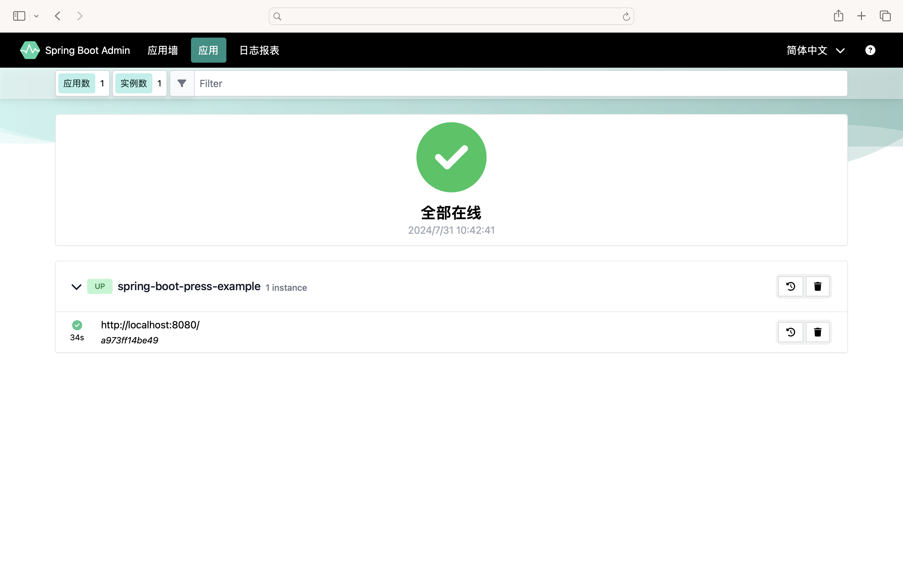
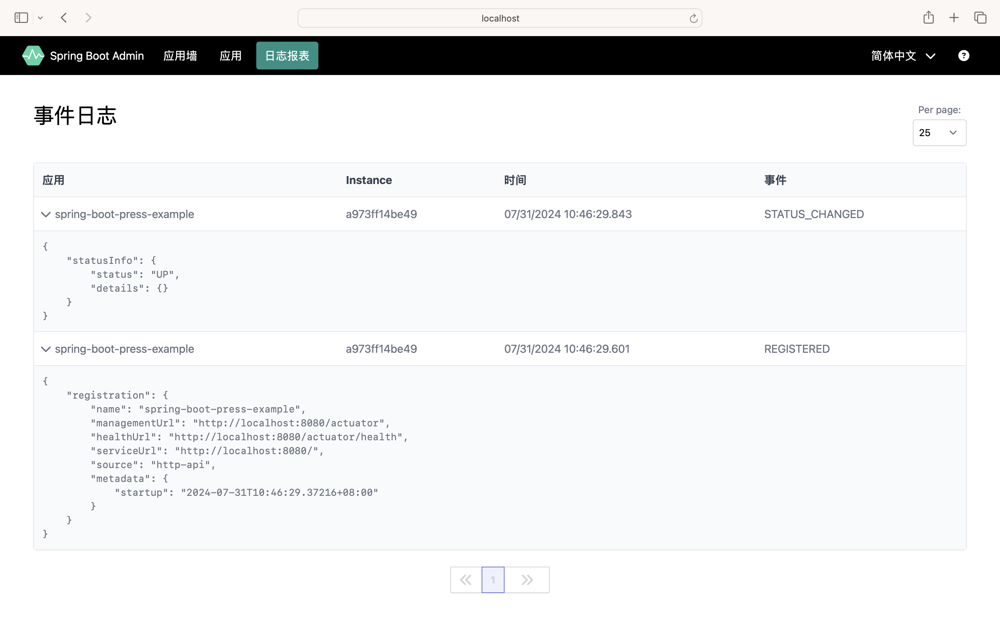
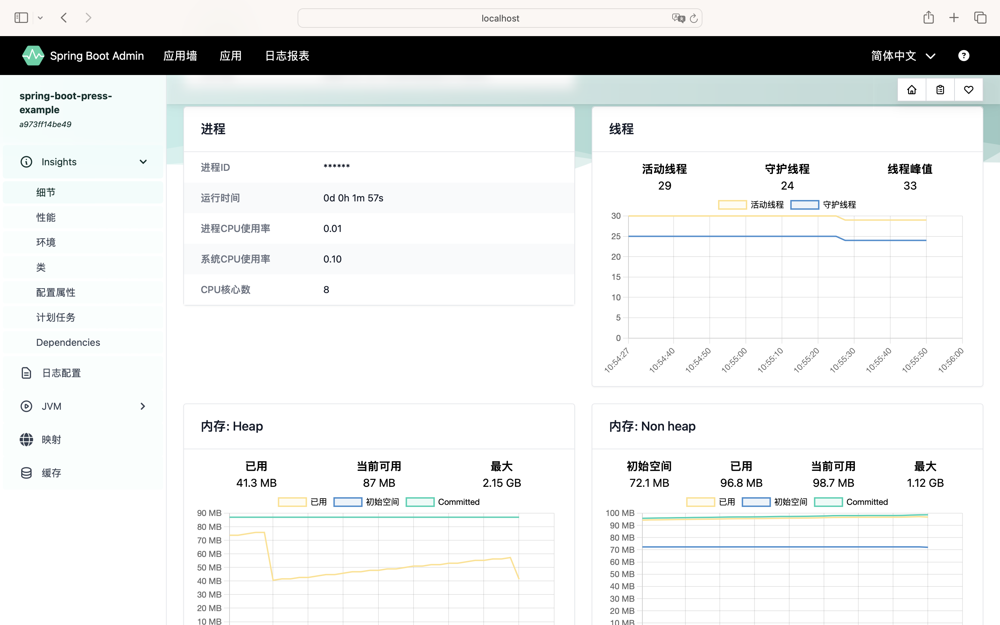
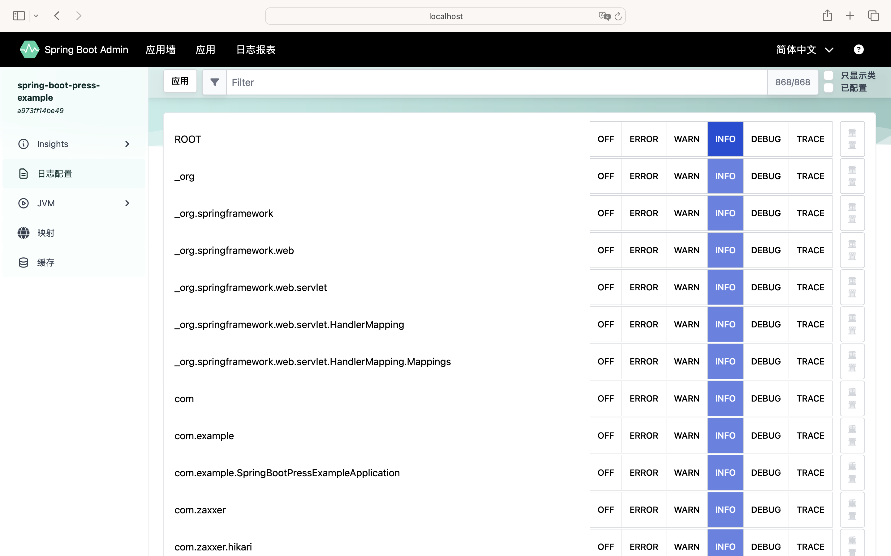
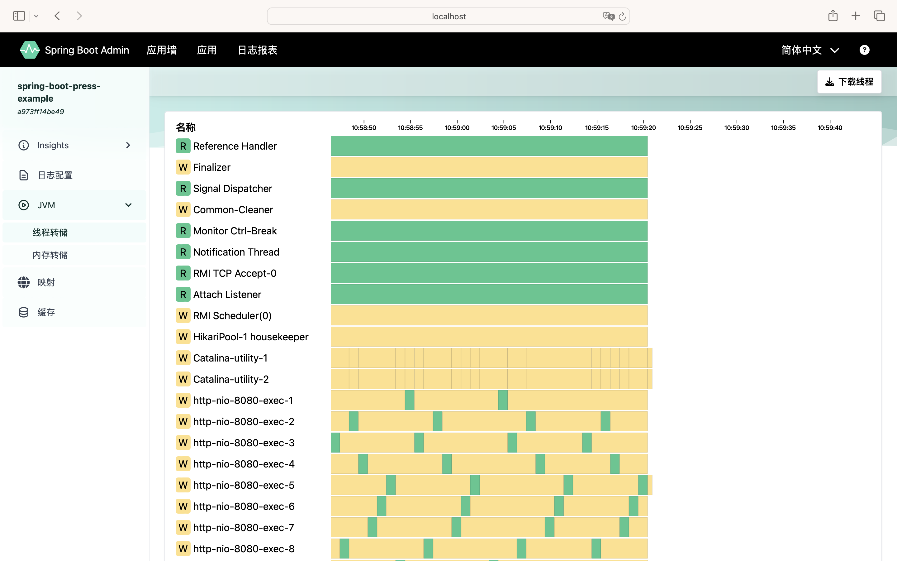
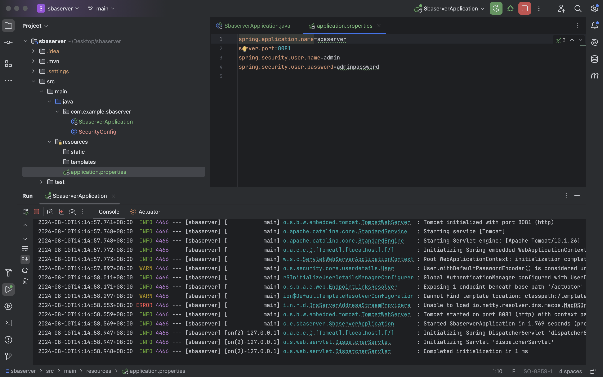
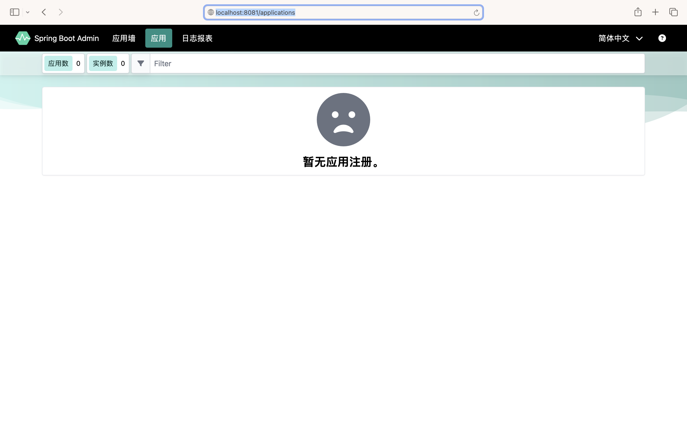
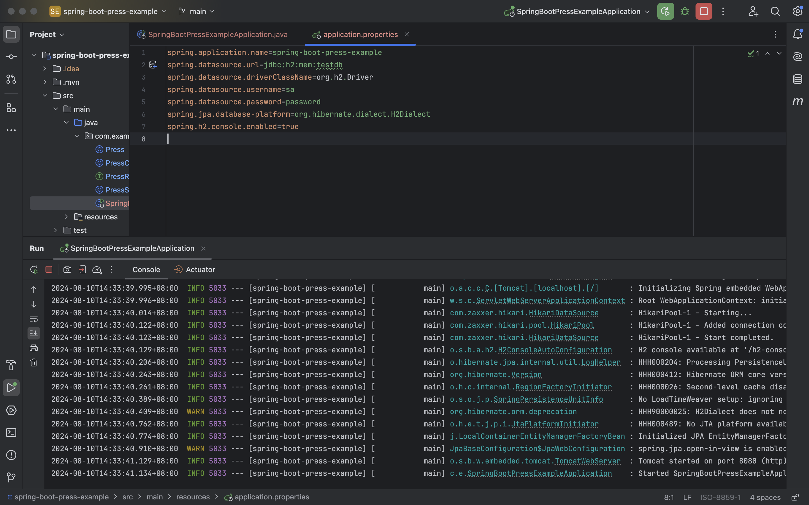
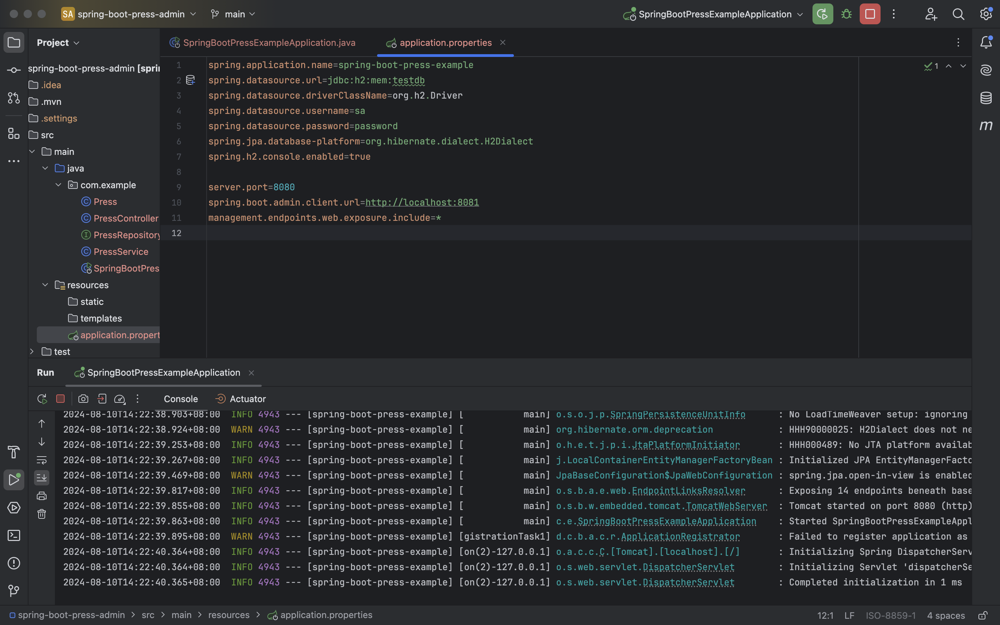
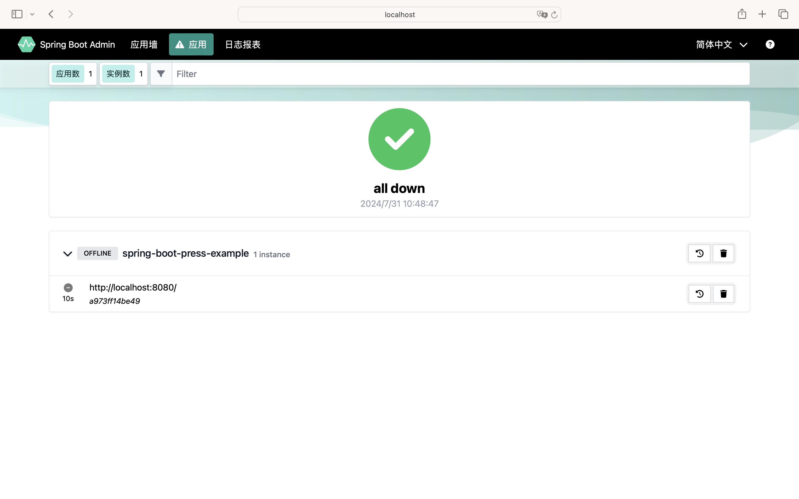

# wk6-springbootadmin
https://www.51cto.com/article/699076.html

Deploy the unified management framework Spring Boot Admin to monitor the operation of a Press System, then add support of spring-boot-actuator for the system, as followed by the Fig.1 below.

Fig.1 SpringBootAdmin

**Step1**, cd sbaserver, run SbaserverApplication.java, as followed by the Fig.2 below.

    
    
    
    
Fig.2 SpringBootAdmin Setup (spring-boot-actuator added)

**Step2**, first,

cd spring-boot-press-example, run SpringBootPressExampleApplication.java, then,

cd spring-boot-press-admin, run SpringBootPressExampleApplication.java, as followed by the Fig.3 below.

    
    
    
    
    
Fig.3 Press System

